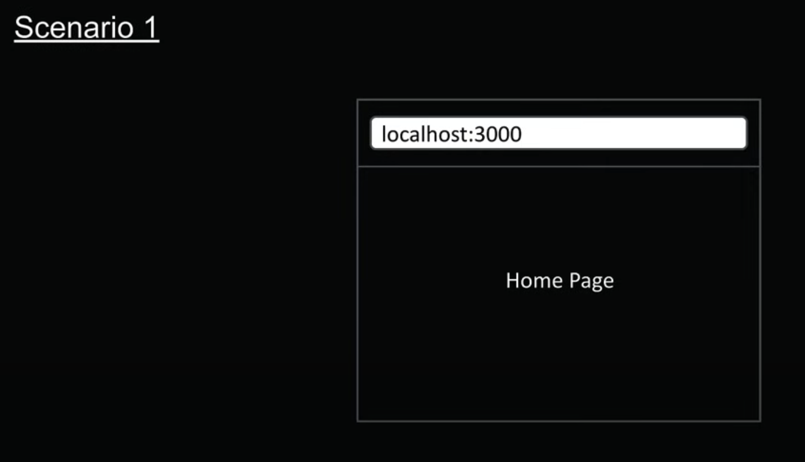
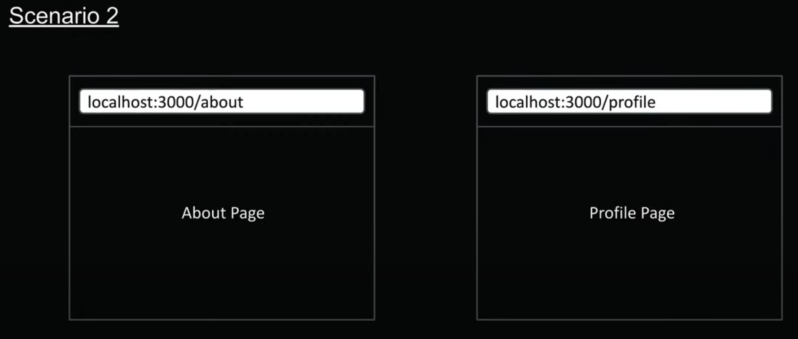
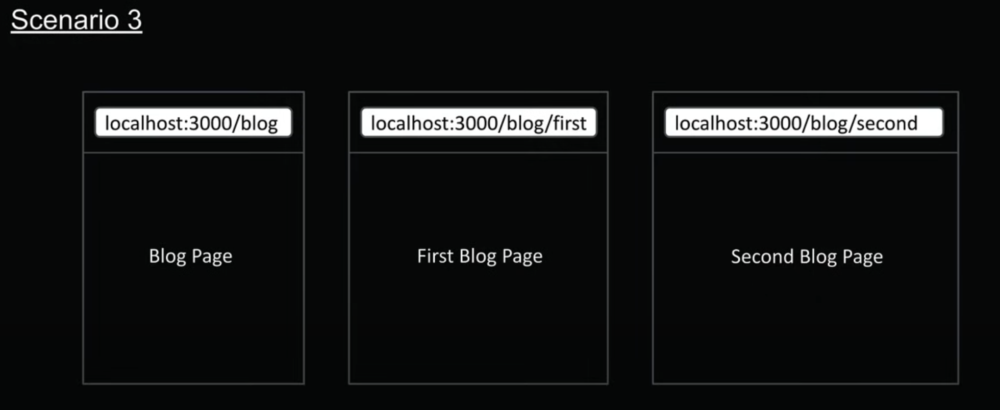
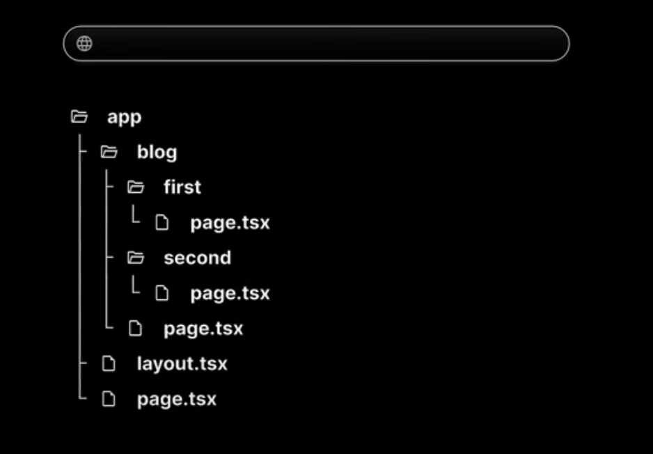
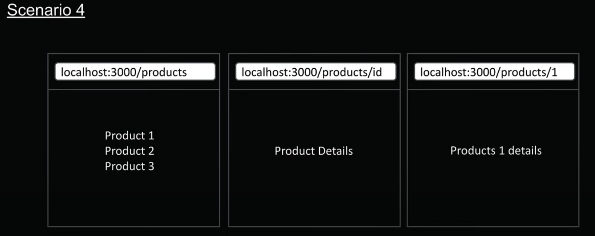
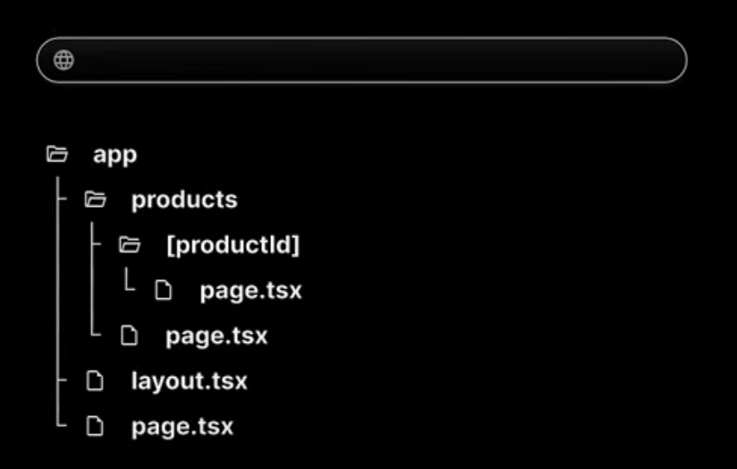

# Next-Js by Codevolution

### What is Next.js ?

- Next.js is a React framework for building full-stack web applications.

### React 

- React alone isn't feasible to create a fully-featured application ready for production.

- React is a library for building user interfaces.

- You need to make decisions about other features such as routing, data fetcing and more.

### Next.js

- It uses React for building user interfaces.

- Provides additional features that enable you to build production-ready applications.

- These features includes routing, optimized rendering, data fetching, bundling, compiling and more.

- You don't need to install additional packages as Next.js provides everything you need.

### Why learn Next.js ?

- Next.js simplifies the process of building production-ready web applications.

1. Routing (File based)
2. API routes
3. Rendering (SSR and CSR)
4. Data fetching (asynchronous components)
5. Styling (Built in support for TailwindCss)
6. Optimization (Image, Link tags, fonts)
7. Dev and prod build system

### `package.json` file breakdown : 

- `dev`: "next dev" : For running the project in development mode. 
- `build`: "next build" : For production builds.
- `start`: "next start" : For running the production server.
- `lint`: "next lint" : For setting up the next.js's built-in eslint configuration.

### Other files : 

- `next.config.ts` : For next.js configuration.
- `tsconfig.json` : For TypeScript configuration.
- `eslint.config.mjs` : For eslint configuration.
- `postcss.config.mjs` : For tailwindcss configuration.

## Before starting with NextJs

### React Server Components(RSC) :

- React Server Component is a new architecture that was introduced by the React team and quickly adopted by Next.js

- This architecture introduces a new approach to creating React components by dividing them into 2 distinct types : 

    - Server Components
    - Client Components

### Server Components : 

- By default, Next.js treats all components as Server components.

- These components can perform server-side tasks like reading files or fetching data directly from a database.

- The trade-off is that they can't use React hooks or handle user interactions.

### Client Components :

- To create a Client component, you'll need to add the "use client" directive at the top of your component file.

- While Client components can't perform server-side tasks like reading files, they can use hooks and handle user interactions.

- Client components are the traditional React components you're already familiar with from previous versions of React.

## Routing 

- Next.js has a file-system based routing system.

- URLs you can access in your browser are determined by how you organize your files and folders in your code.

### Routing conventions : 

1. All routes must live inside the app folder.
2. Route files must ne named either page.js or page.tsx
3. Each folder represents a segment of the URL path.

**NOTE :** When these conventions are followed, the file automatically becomes available as a route.

### File based routing : 

**Scenario 1 :**

- `page.tsx` file inside the app folder automatically maps to your site's URL.

- If you deleted `layout.tsx` file, the next.js will automatically re-create that file when you first access the root route.

**Scenario 2 :**

- Create 2 folders named `about` and `profile` inside app directory.

- Inside those files create a file named `page.tsx` and export a default function(component).

- The routes are directly tied to their folder names within the app directory.

**Scenario 3 :** Nested Routes

- Inside app directory create another folder named `blog`.

- Create a `page.tsx` file.

- Then create 2 new folders named `first` and `second` inside the `blog` folder.

- Create `page.tsx` inside both `first` and `second` folder.

Solution : 

**NOTE :** Next.js mirrors your folder structure in your URL's automatically.

**Scenario 4 :** Dynamic Routes

- Create a folder named `products` and a `page.tsx` file inside it.

- Create anther folder named `productId` wrapped within the square brackets, inside the `products` folder.

- Inside the `[productId]` folder, create a `page.tsx`, where you'll receive whatever is passed in the URL after the `http://localhost:3000/products`

Solution : 
